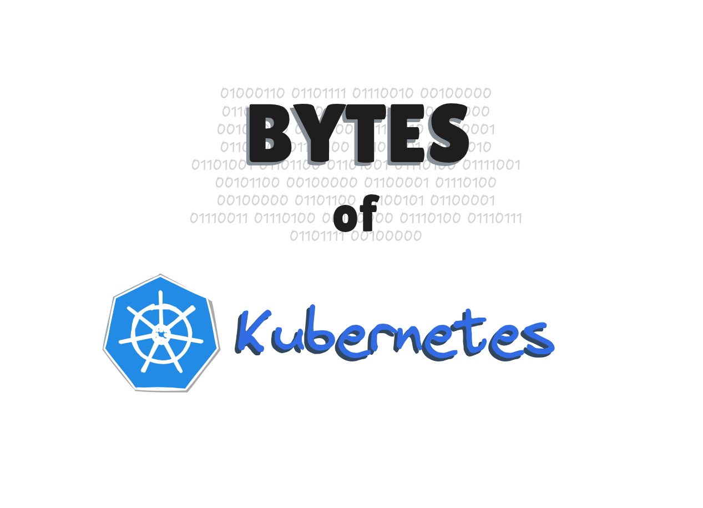

  

## Repositorio de Estudos Kubernetes

Este repositorio contem materiais, arquivos de configuracao e roteiros de laboratorios dedicados ao aprendizado de Kubernetes. O conteudo e estruturado para cobrir desde os fundamentos teoricos ate a implementacao de workloads complexos e gerenciamento de infraestrutura.

### Visao Geral do Kubernetes

O Kubernetes e uma plataforma de orquestracao de containers que automatiza a implantacao, o dimensionamento e a operacao de aplicativos em containers. Ele permite gerenciar clusters de hosts que executam containers, facilitando a escalabilidade e a alta disponibilidade dos servicos.

### Estrutura do Conteúdo

A trilha de aprendizado está organizada nos seguintes pilares principais:

* **Arquitetura e Fundamentos:** Abrange desde a comparação entre VMs e Containers até o detalhamento dos componentes do Control Plane e Worker Nodes.
* **Workloads:** Implementação de objetos como Pods, Deployments, StatefulSets e as diferenças entre Jobs e CronJobs.
* **Persistência e Configuração:** Gerenciamento de volumes (PV, PVC), além do uso de Namespaces, ConfigMaps e Secrets para organização e segurança.
* **Exposição e Automação:** Explora a camada de rede (Services e LoadBalancers) e ferramentas de automação como Helm e Operators.

Este roteiro serve como base para os laboratórios práticos, sendo atualizado conforme novas tecnologias e workloads são explorados no canal.

### Laboratorios e Aulas

Os arquivos estao organizados para acompanhar as aulas praticas. Os temas listados possuem um manifesto YAML correspondente para execucao em ambiente de lab. O objetivo e proporcionar uma experiencia direta com a linha de comando e a administracao do cluster, permitindo a validacao de cada conceito apresentado.
